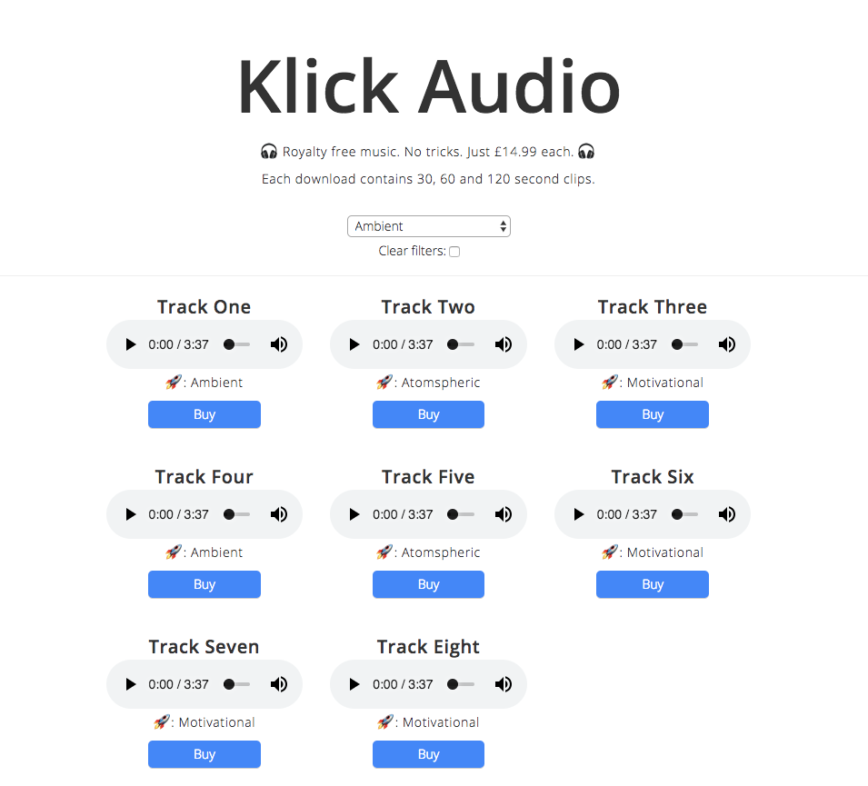

# This is a e-commerce - download template

### The aim of this project was to include Stripe API with a React project.

Built with:
  - ReactJS
  - ExpressJS
  - Stripe
  - AWS S3

It currently:
  - Appends song genres to filter list
  - Filters results on selected drop-down
  - Successfully processes payments
  - Displays messages if payments are successful/unsuccessful

Not implemented yet:
  - Song download after payment (quite important for a download site!)

